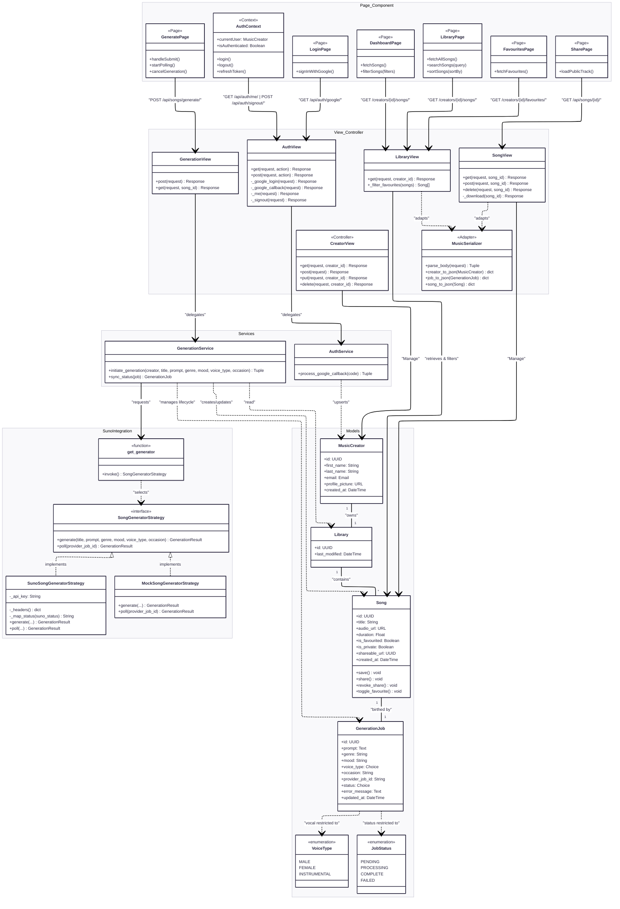

# Cantio

A full-stack AI music orchestrator. Generate original tracks from text prompts
using the Suno AI engine (or a local mock), manage your library, and share your
masterpieces.

## Tech Stack

- **Frontend:** Next.js 15 (App Router), TypeScript, Tailwind CSS, Framer Motion
- **Backend:** Django 6.0 (REST), PostgreSQL, Strategy Pattern for AI Providers
- **Auth:** Google OAuth 2.0 with session-based persistence

---

## Setup & Run

### 1. Environment Setup

Copy the example environment file:

- **Mac/Linux:** `cp backend/.env.example backend/.env`
- **Windows:** `copy backend\.env.example backend\.env`

### 2. Google OAuth Configuration

1. Go to
   [Google Cloud Console](https://console.cloud.google.com/apis/credentials).
2. Create **OAuth 2.0 Client ID** (Web Application).
3. **Authorized JavaScript origins:** `http://localhost:3000`
4. **Authorized redirect URIs:**
   `http://localhost:8000/api/auth/google/callback/`
5. Copy `Client ID` and `Client Secret` to `backend/.env`.

### 3. Suno AI Setup

1. Get an API key from [SunoAPI.org](https://sunoapi.org).
2. In `backend/.env`, set:
   - `GENERATOR_STRATEGY=suno` (use `mock` for offline dev)
   - `SUNO_API_KEY=your_key_here`

### 4. Launch (Docker)

**Prerequisites:** Docker Desktop

```bash
docker-compose up -d --build
```

- **Frontend:** `http://localhost:3000`
- **Backend API:** `http://localhost:8000`
- **API Docs:** `http://localhost:8000/api/docs/`

---

## Local Development (No Docker)

### Backend (Django)

1. `cd backend`
2. `python -m venv .venv` && `source .venv/bin/activate`
3. `pip install -r requirements.txt`
4. Configure `.env` (Set `POSTGRES_HOST=localhost`), then
   `python manage.py migrate`
5. `python manage.py runserver`

### Frontend (Next.js)

1. `cd frontend`
2. `npm install`
3. `npm run dev`

---

## Key Features & Architecture

### Robust Generation Lifecycle

- **Idempotency**: Implements a "Create Job Early" strategy with database
  transactions to prevent duplicate song creation.
- **Async Polling**: The frontend uses a resilient polling mechanism with clean
  state cleanup on navigation.

### Strategy Pattern (AI Providers)

The system abstracts the music provider via a Strategy Pattern. Toggle providers
in `.env`:

- `GENERATOR_STRATEGY=mock`: Instant offline generation (no API key needed).
- `GENERATOR_STRATEGY=suno`: Live AI generation via
  [SunoAPI.org](https://sunoapi.org).

### Architecture Diagram



### Sequence Diagram

Check out at [docs](/docs/sequence_diagrams.md)

### Testing

Run backend tests to verify the generation logic and API integrity.

_Note: Run these commands from the project root._

**Using Docker (Recommended):**

```bash
docker-compose exec backend python manage.py test music.tests
```

**Local (Requires Venv):**

```bash
cd backend
python manage.py test music.tests
```
