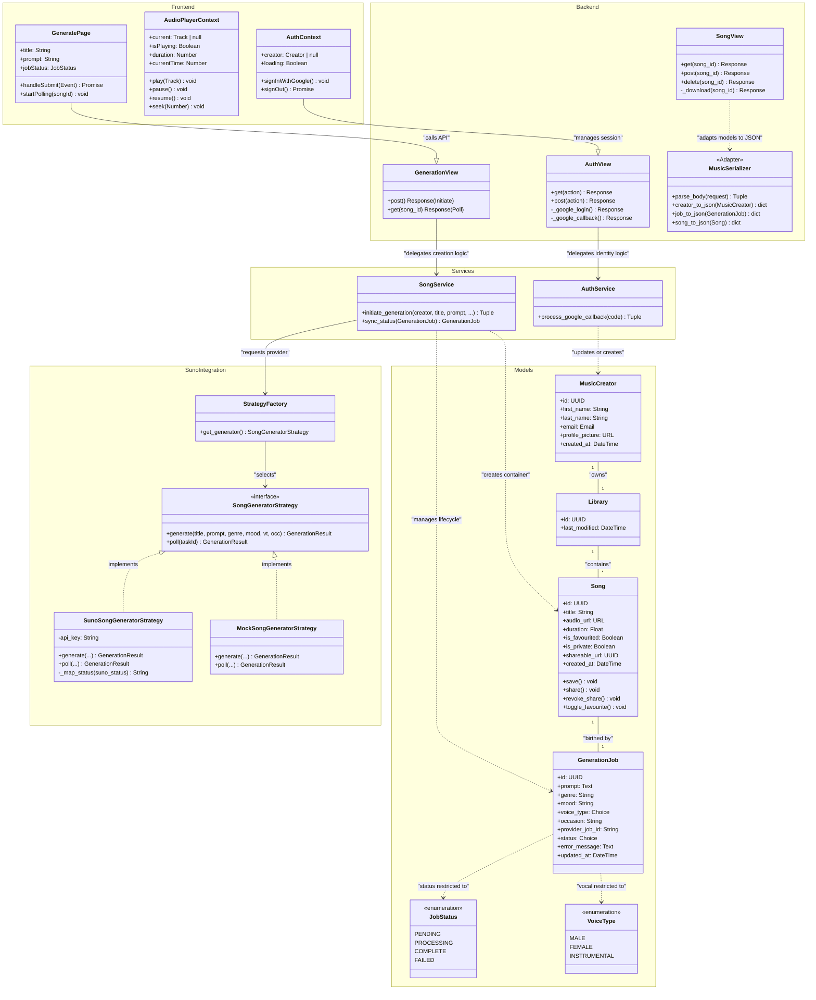

# Comprehensive Architectural Class Diagram — Cantio

This diagram follows a **Layered Architecture** and **GRASP** patterns, visualized in a high-fidelity structure similar to enterprise blueprints.

## Architectural Flow Description

1.  **Identity Orchestration**: The `AuthContext` (Frontend) triggers a redirect to `AuthView` (Backend), which delegates to `AuthService` (Service). The `AuthService` verifies the Google JWT and performs an **Upsert** on the `MusicCreator` model.
2.  **Creation Pipeline**: When `GeneratePage` submits, `GenerationView` calls `SongService.initiate_generation()`. This service acts as a **GRASP Indirection** layer:
    *   It creates a `Song` (the Asset) and a `GenerationJob` (the Recipe/Audit Log).
    *   It uses the `StrategyFactory` to obtain a `SongGeneratorStrategy`.
    *   It executes the strategy and stores the external `provider_job_id`.
3.  **Completion Logic**: On successful generation (either immediate for Mock or via polling for Suno), the `SongService` moves the final `audio_url` and `duration` from the AI response to the `Song` entity for **Permanent Storage**.
4.  **Information Expert**: The `Song` model manages its own interaction states (`favourite`, `share`, `revoke`). These methods encapsulate state transitions directly within the domain entity.
