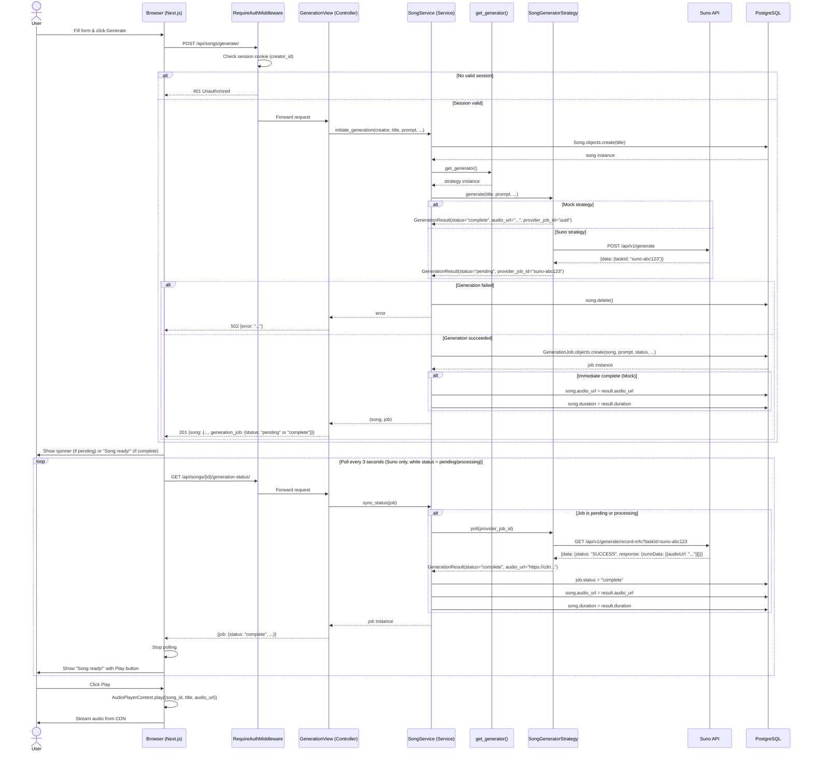

# Sequence Diagram — Song Generation Use Case

This diagram covers the full lifecycle of song generation, from form submission through async polling to playback.

## Key Design Decisions

| Decision | Rationale |
|---|---|
| **Service Layer Indirection** | The `SongService` orchestrates the domain story, decoupling the `GenerationView` from models and strategies (GRASP Indirection). |
| **Strategy Pattern** | `SongService` depends only on the `SongGeneratorStrategy` interface (Protected Variations). |
| **Permanent Asset Ownership** | `Song` owns `audio_url` and `duration` for persistence, while `GenerationJob` owns the "recipe" (prompt, style) and the "process" status. |
| **Information Expert** | The `Song` model manages its own interaction states (favourite/share). |
