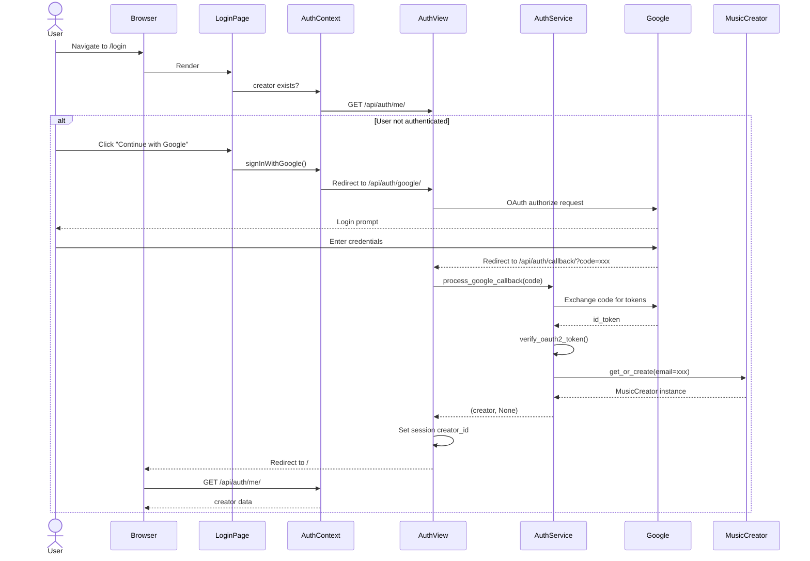
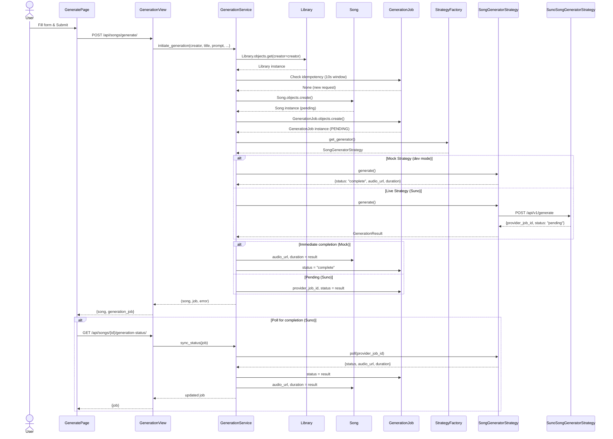
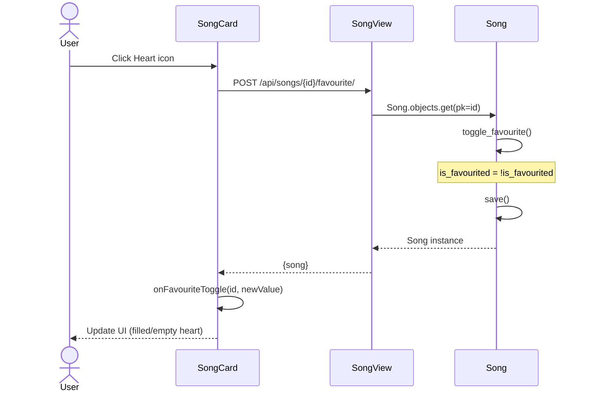
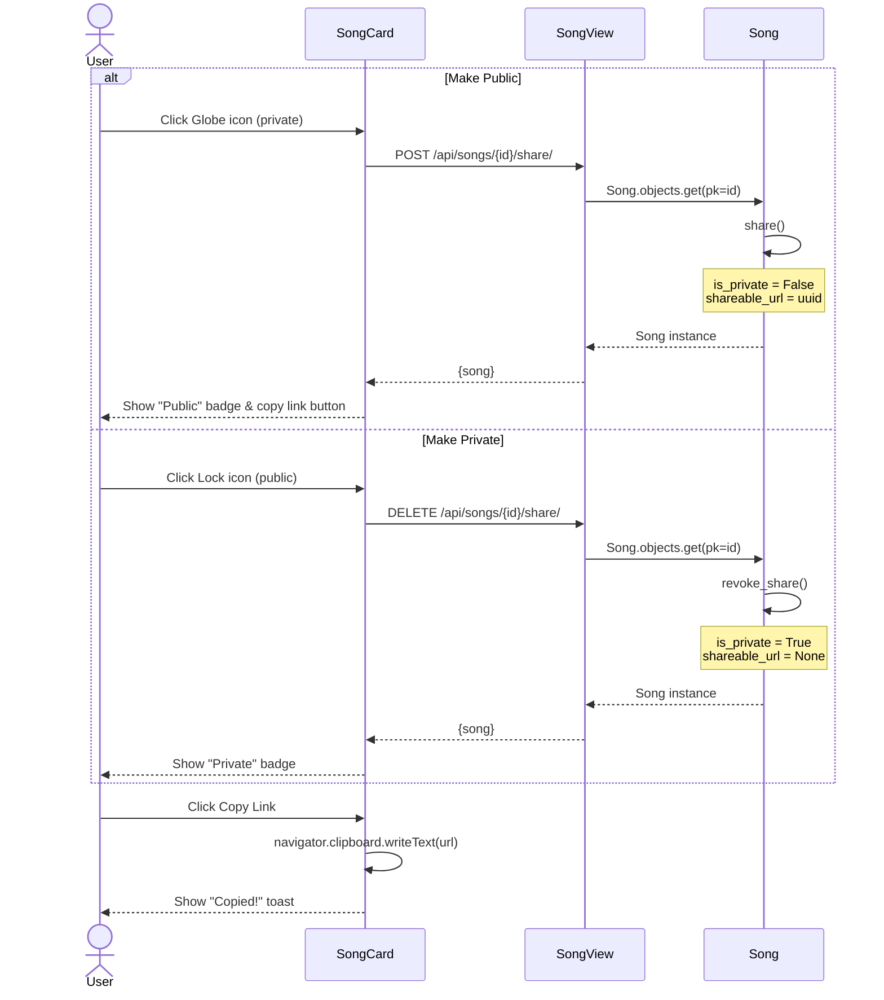
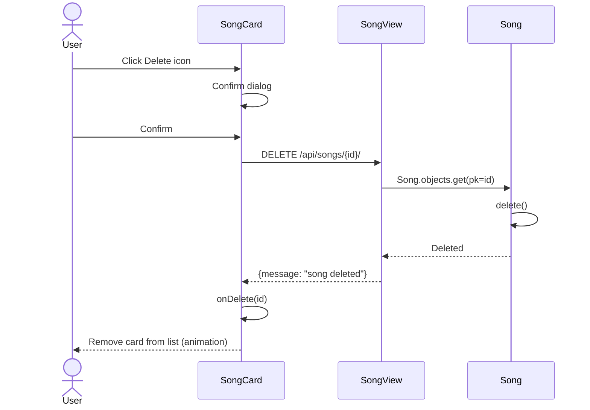
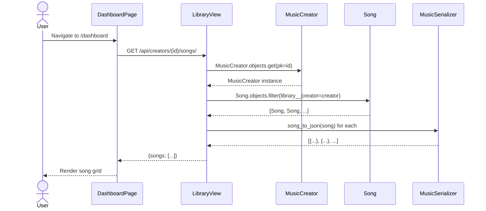
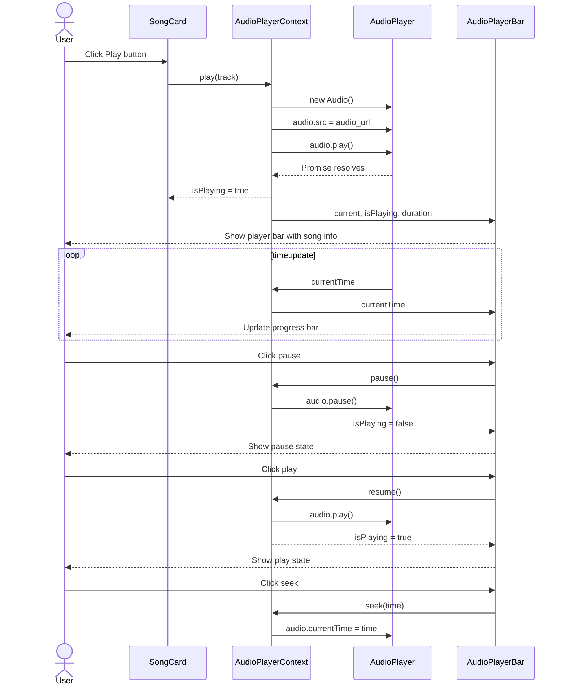
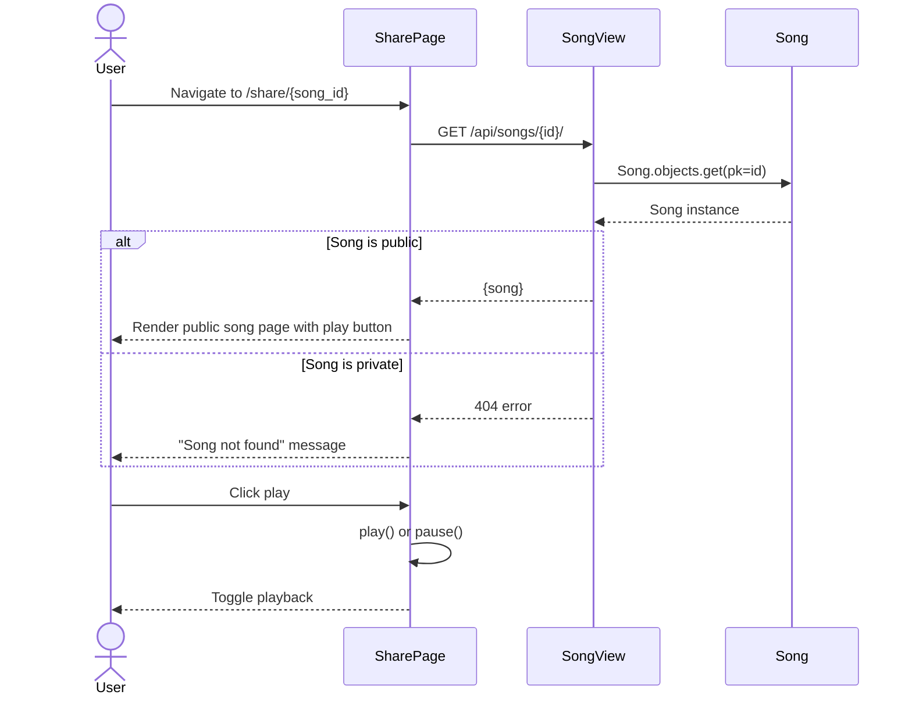

# Sequence Diagrams — Cantio

This document illustrates the dynamic behavior of Cantio through **Mermaid sequence diagrams**.

---

## 1. Authentication Flow (Google OAuth)

---

## 2. Song Generation Flow

---

## 3. Favourite/Unfavourite Flow

---

## 4. Share/Unshare Flow

---

## 5. Delete Song Flow

---

## 6. Fetch Library Flow

---

## 7. Audio Playback Flow

---

## 8. Shared Song Access Flow

